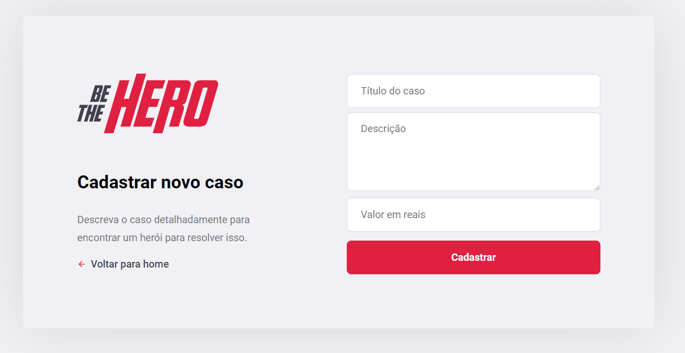

<h2 align="center"> Aplicação para conectar ONGs e outras instituições a pessoas que podem ajudar </h2>
<h3 align="center"> Criada com React, React Native, Node e SQLite </h3>

---

## Para rodar a aplicação

> Observação: É possível utilizar os gerenciadores de pacote NPM ou Yarn para rodar os comandos abaixo:

<h3>BACK-END</h3>

Execute o comando ```npm install``` nas pastas backend, frontend e mobile, para instalar as dependências.

<h3>FRONT-END</h3>

Execute o comando ```npm start``` nas pastas backend e frontend para utilizar a versão web. Acesse via **localhost:3000**.

<h3>MOBILE</h3>

Execute o comando ```npm start``` na pasta do backend e utilizando o expo no celular, rode ```expo start``` na pasta do mobile para abrir o expo no computador e poder escanear o QR Code da aplicação. 


## Telas

<p align="center">
    <h3 align="center"> FRONT-END LOGIN </h3>    
        
    <h3 align="center"> FRONT-END CADASTRO </h3>    
        
    <h3 align="center"> FRONT-END PERFIL DA ONG </h3>
    
    <h3 align="center"> FRONT-END CADASTRO DE NOVO CASO </h3>
    
    <h3 align="center"> MOBILE SPLASH ART </h3>
    
    <h3 align="center"> MOBILE CASOS </h3>
    
    <h3 align="center"> MOBILE DETALHE DO CASO </h3>
    
    <h3 align="center"> MOBILE CONTATO VIA E-MAIL </h3>
    
</p>
